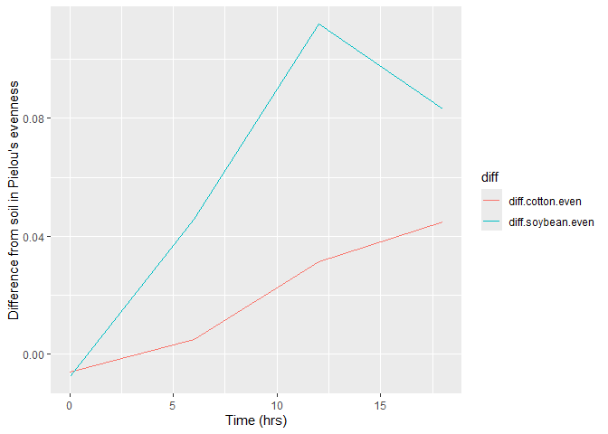

## Coding challenge 5

### Question 1

Reading the data into R:

``` r
diversity <- read.csv("DiversityData.csv")
meta <- read.csv("Metadata.csv", na.strings = "na")
```

### Question 2

Joining dataframes together:

``` r
library(tidyverse) # loading required package
```

    ## ── Attaching core tidyverse packages ──────────────────────── tidyverse 2.0.0 ──
    ## ✔ dplyr     1.1.4     ✔ readr     2.1.5
    ## ✔ forcats   1.0.0     ✔ stringr   1.5.1
    ## ✔ ggplot2   3.5.1     ✔ tibble    3.2.1
    ## ✔ lubridate 1.9.4     ✔ tidyr     1.3.1
    ## ✔ purrr     1.0.4     
    ## ── Conflicts ────────────────────────────────────────── tidyverse_conflicts() ──
    ## ✖ dplyr::filter() masks stats::filter()
    ## ✖ dplyr::lag()    masks stats::lag()
    ## ℹ Use the conflicted package (<http://conflicted.r-lib.org/>) to force all conflicts to become errors

``` r
alpha <- left_join(diversity, meta, by = "Code")
```

### Question 3

Finding Pielou’s evenness:

``` r
alpha_even <- alpha %>%
  mutate(even = shannon/log(richness))
```

### Question 4

Finding the mean and standard error evenness grouped by crop over time:

``` r
alpha_average <- alpha_even %>%
  group_by(Crop, Time_Point) %>%
  summarise(Mean.even = mean(even),
            n = n(),
            sd.dev = sd(even)) %>%
  mutate(std.error = sd.dev/sqrt(n))
```

    ## `summarise()` has grouped output by 'Crop'. You can override using the
    ## `.groups` argument.

### Question 5

Calculating the difference between the soybean column, the soil column,
and the difference between the cotton column and the soil column.

``` r
alpha_average2 <- alpha_average %>%
  select(Time_Point, Crop, Mean.even) %>%
  pivot_wider(names_from = Crop, values_from = Mean.even) %>% # pivot to wide format
  mutate(diff.cotton.even = Soil - Cotton) %>%
  mutate(diff.soybean.even = Soil - Soybean)
```

### Question 6

Making plots:

``` r
alpha_average2 %>%
  select(Time_Point, diff.cotton.even, diff.soybean.even) %>%
  pivot_longer(c(diff.cotton.even, diff.soybean.even), names_to = "diff") %>%
  ggplot(aes(x = Time_Point, y = value, color = diff)) + # changing color to 'diff' variable
  geom_line() +
  xlab("Time (hrs)") +
  ylab("Difference from soil in Pielou's evenness")
```

<!-- -->

### Question 7

Link to GitHub: [Coding Challenge 5
Directory](https://github.com/sarahbatten/PLPA6820)
